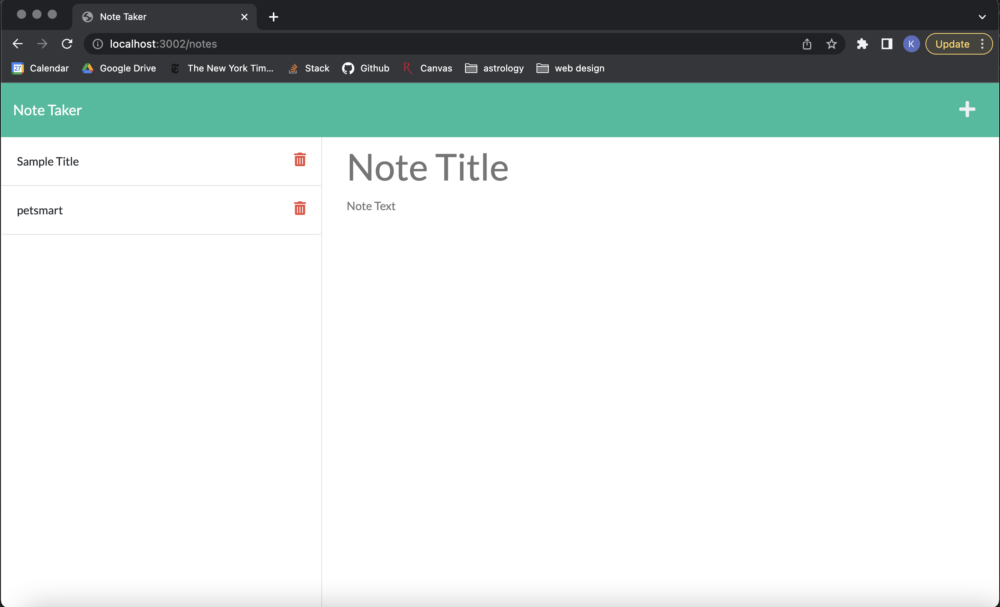

# Note Taker Starter Code

## Description

The Note Taker app works as a container for notes.  The page loads the data that is input by users.  The user can post notes to the server which are held in the json file, given a unique id, and then returned back onto the webpage. When a user clicks on a note, it is displayed in the main text field of the page. 

## Used
JavaScript, HTML, CSS, Node.js, express.js, uniqid.js

## Usage

## Questions
Email: kelwacker@gmail.com
Github: https://github.com/kwax17